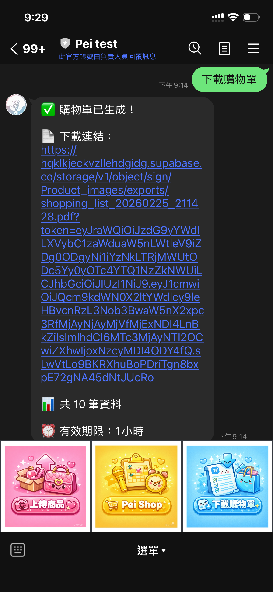
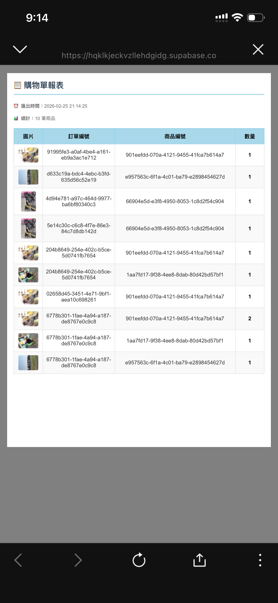

# LINE PDF Generator - 購物單生成器

<div align="center">

## 🚀 LINE x AI 全自動代購革命

**📸 拍照 → 🤖 AI 辨識 → 🛒 購物車 → 📄 PDF 訂單**

### 訂單輸出模組：一鍵下載精美購物單 PDF

</div>

> 💡 **完整解決方案 - 三大專案打造極致代購體驗**  
> 本專案是 **LINE x AI 自動化代購生態系統** 的訂單輸出模組，需配合以下專案完整運作：
> 
> 1. **[AI-Driven Product Ingestion Pipeline](https://github.com/Backy-JP/AI-Driven_Product_Ingestion_Pipeline_with_LINE_LIFF_and_n8n)** - 📸 拍照上傳 + 🤖 AI 商品辨識與資料自動化建檔
> 2. **[LINE LIFF Ecommerce Cart](https://github.com/Backy-JP/LINE_LIFF_Ecommerce_Cart)** - 🛒 LINE 購物車與訂單系統
> 3. **[LINE PDF Generator](https://github.com/Backy-JP/LINE_PDF_Generator)** - 📄 本專案：一鍵生成購物清單 PDF
> 
> **從商品拍攝到訂單下載，全程 LINE 完成，無需跳轉外部平台！**

---

一個整合 LINE Bot 的 PDF 購物單生成系統，可自動從 Supabase 資料庫取得訂單資料，生成包含產品圖片的精美 PDF 報表。

## ✨ 功能特色

- 📱 **LINE Bot 整合**：透過圖文選單或文字訊息觸發
- 📊 **自動生成 PDF**：包含訂單編號、商品編號、數量和產品圖片
- 🖼️ **智慧圖片處理**：自動壓縮並嵌入圖片，避免載入問題
- ☁️ **Supabase 儲存**：PDF 自動上傳至 Supabase Storage
- 🔗 **即時分享**：產生有效期 1 小時的下載連結
- 🎨 **美觀設計**：表格清晰易讀

## 📋 系統需求

- Python 3.9+
- ngrok（用於本地開發）
- LINE Messaging API 帳號
- Supabase 帳號

## 🚀 快速開始

### 1. 安裝依賴

```bash
cd /Users/hsiehjiapei/Desktop/line_pdf
python3 -m venv venv
source venv/bin/activate  # Windows: venv\Scripts\activate
pip install -r requirements.txt
playwright install chromium
```

### 2. 設定環境變數

建立 `.env` 檔案：

```env
# Supabase 設定
SUPABASE_URL=https://your-project.supabase.co
SUPABASE_SERVICE_ROLE_KEY=your_service_role_key

# LINE Bot 設定
LINE_CHANNEL_SECRET=your_channel_secret
LINE_CHANNEL_ACCESS_TOKEN=your_channel_access_token
```

### 3. 啟動服務器

**終端機 1：啟動 FastAPI**

```bash
cd /Users/hsiehjiapei/Desktop/line_pdf
source venv/bin/activate
python -m uvicorn main:app --host 0.0.0.0 --port 8000 --reload
```

或使用完整路徑（推薦）：

```bash
cd /Users/hsiehjiapei/Desktop/line_pdf
/Users/hsiehjiapei/Desktop/line_pdf/venv/bin/python -m uvicorn main:app --host 0.0.0.0 --port 8000 --reload
```

**終端機 2：啟動 ngrok**

```bash
ngrok http 8000
```

### 4. 設定 LINE Webhook

1. 複製 ngrok 提供的 HTTPS 網址（例如：`https://xxxx.ngrok-free.dev`）
2. 前往 [LINE Developers Console](https://developers.line.biz/console/)
3. 選擇你的 Messaging API 頻道
4. 更新 **Webhook URL** 為：`https://xxxx.ngrok-free.dev/webhook`
5. 點擊 **Update** 然後 **Verify**
6. 確保 **Use webhook** 開關是開啟的

## 📁 專案結構

```
line_pdf/
├── main.py              # 主程式（FastAPI + LINE Bot 邏輯）
├── requirements.txt     # Python 依賴套件
├── .env                 # 環境變數（不提交到 Git）
├── README.md            # 專案說明文件
├── images/              # README 使用的截圖
└── venv/                # Python 虛擬環境
```

## 🎯 使用方式

在 LINE 聊天室中：

1. **點擊圖文選單按鈕**（如已設定）
2. **或傳送文字訊息**：`下載購物單`

### 📱 功能展示

<table>
  <tr>
    <td width="50%" align="center">
      <br/>
      <b>📱 LINE 對話流程</b><br/>
      <sub>點擊「下載購物單」按鈕後，系統自動回覆 PDF 下載連結</sub>
    </td>
    <td width="50%" align="center">
      <br/>
      <b>📄 PDF 購物單報表</b><br/>
      <sub>包含訂單編號、商品編號、產品圖片與數量的完整報表</sub>
    </td>
  </tr>
</table>

### 🔄 處理流程

系統會自動：
- 查詢最新 10 筆訂單資料
- 下載並壓縮產品圖片（60x60，品質 40%）
- 生成包含圖片的 PDF
- 上傳到 Supabase Storage
- 回傳下載連結（有效期 1 小時）

## 🗃️ 資料庫結構

### order_items 表

| 欄位 | 類型 | 說明 |
|------|------|------|
| order_id | text | 訂單編號 |
| product_id | text | 商品編號 |
| qty | integer | 數量 |
| created_at | timestamp | 建立時間 |

### product_images_2 表

| 欄位 | 類型 | 說明 |
|------|------|------|
| product_id | text | 商品編號（對應 order_items） |
| image_path | text | 圖片路徑或 URL |

### Supabase Storage

- **Bucket 名稱**：`Product_images`
- **用途**：儲存產品圖片和生成的 PDF
- **權限**：建議設為公開讀取

## 🛠️ 技術棧

- **FastAPI**：高效能 Web 框架
- **Playwright**：無頭瀏覽器，用於 PDF 生成
- **Supabase**：後端即服務（資料庫 + 儲存）
- **LINE Messaging API**：聊天機器人整合
- **Pillow**：圖片處理與壓縮
- **Jinja2**：HTML 模板引擎

## 🔧 故障排除

### ❌ LINE Bot 沒反應

1. 檢查 FastAPI 服務器是否運行：`lsof -ti :8000`
2. 檢查 ngrok 是否運行：`ps aux | grep ngrok`
3. 確認 LINE Webhook URL 是最新的 ngrok 網址
4. 查看 FastAPI 終端的日誌輸出
5. 確認 Webhook 路徑為 `/webhook`（不是 `/line/webhook`）

### 🖼️ PDF 沒有圖片

- 檢查 `product_images_2` 表是否有對應的 `product_id`
- 確認圖片路徑正確且可訪問
- 查看終端日誌中的圖片下載狀態
- 確認 Supabase Storage 的 `Product_images` bucket 存在

### 📤 上傳失敗

- 確認 Supabase URL 和 Service Role Key 正確
- 檢查 `Product_images` bucket 是否已建立
- 確認 PDF 檔案大小未超過 10MB
- 查看終端詳細錯誤訊息

### 🔄 修改後未生效

FastAPI 使用 `--reload` 參數會自動重載，但如果有問題：

```bash
# 停止服務器
lsof -ti :8000 | xargs kill -9

# 重新啟動
cd /Users/hsiehjiapei/Desktop/line_pdf
/Users/hsiehjiapei/Desktop/line_pdf/venv/bin/python -m uvicorn main:app --host 0.0.0.0 --port 8000 --reload
```

## 📝 常用指令速查

### 啟動服務器（完整流程）

```bash
# 1. 停止舊服務（如有需要）
lsof -ti :8000 | xargs kill -9
pkill ngrok

# 2. 啟動 FastAPI（終端機 1）
cd /Users/hsiehjiapei/Desktop/line_pdf
/Users/hsiehjiapei/Desktop/line_pdf/venv/bin/python -m uvicorn main:app --host 0.0.0.0 --port 8000 --reload

# 3. 啟動 ngrok（終端機 2）
ngrok http 8000

# 4. 取得 ngrok 網址
curl -s http://127.0.0.1:4040/api/tunnels | python3 -m json.tool | grep "public_url"
```

### 檢查服務狀態

```bash
# 檢查 FastAPI
lsof -ti :8000

# 檢查 ngrok
ps aux | grep ngrok | grep -v grep
```

## 🎨 自訂設定

### 修改查詢筆數

在 `main.py` 第 105 行：

```python
# 從 10 筆改為 20 筆
.limit(10)  →  .limit(20)
```

### 修改圖片大小

在 `main.py` 第 152 行：

```python
# 從 60x60 改為 80x80
img.thumbnail((60, 60), ...)  →  img.thumbnail((80, 80), ...)
```

### 修改圖片品質

在 `main.py` 第 156 行：

```python
# 從 40% 改為 60%
quality=40  →  quality=60
```

### 修改下載連結有效期

在 `main.py` 第 347 行：

```python
# 從 3600 秒（1 小時）改為 7200 秒（2 小時）
create_signed_url(file_name, 3600)  →  create_signed_url(file_name, 7200)
```

## 📄 授權

本專案僅供個人使用與學習。

## 🤝 貢獻

如有任何問題或建議，歡迎提出！

---

**最後更新**：2026-02-25  
**版本**：2.0.0（使用 Supabase Storage）
